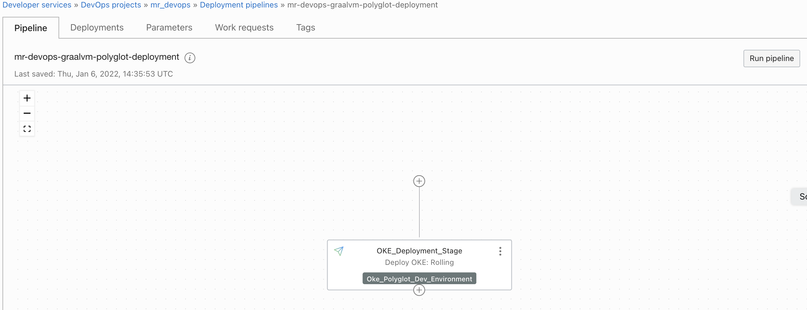
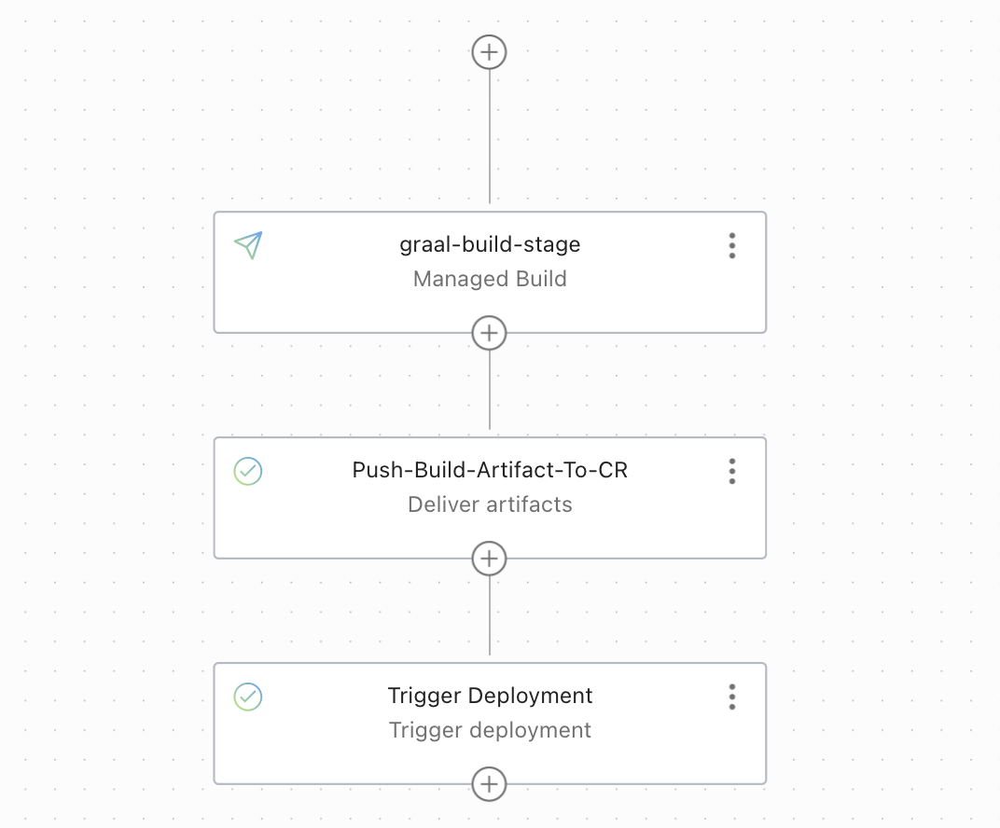

Sample illustration of build and deploy a polyglot application with Graal VM and  OCI Devops.

-------

🪄 Objective .

- Make a sample build and deploy using Polyglot application with Graal VM.
- Its encomposed with nodejs and R application language.
- the build and Deployment is orchestrated with OCI devops services .
- The application will be deployed on to OCI OKE.

Specific instructions to download only this sample.
---

```
    $ git init oci_devops_sample
    $ cd oci_devops_sample
    $ git remote add origin <url to this git repo>
    $ git config core.sparsecheckout true
    $ echo "oci-pipeline-examples/oci-java-graalvm-devops-example/*">>.git/info/sparse-checkout
    $ git pull --depth=1 origin main

```

🖨️ How to use it .

- Create an OCI Devops Project  - https://docs.oracle.com/en-us/iaas/Content/devops/using/devops_projects.htm 

- Create a container registry and update the value to the deployment_spec.yaml for your reference.

    - https://docs.oracle.com/en-us/iaas/Content/Registry/home.htm 


- Create an OCI Build pipeline & Add manage build , Artifactory steps - https://docs.oracle.com/en-us/iaas/Content/devops/using/managing_build_pipelines.htm 

    - You may use OCI Repo or GITHUB with external connection as the source for buils.

- Create an OCI Deployment pipeline with OKE deployment stage.

    -  https://docs.oracle.com/en-us/iaas/Content/ContEng/home.htm

    - https://docs.oracle.com/en-us/iaas/Content/devops/using/environments.htm 

    - https://docs.oracle.com/en-us/iaas/Content/devops/using/artifacts.htm 

    - https://docs.oracle.com/en-us/iaas/Content/devops/using/deployment_pipelines.htm 



    - Specify below as deployment parameters.
    - Refer deployment_spec.yaml for deployment manifest (as an inline or use with OCI artifactory) and the type as 'kube manifest' 


- Add an invoke deployment stage to your Build pipeline - https://docs.oracle.com/en-us/iaas/Content/devops/using/triggerdeploy_stage.htm 




Finally 

---

- Post the successfull build /deployment ,connect to oke and execute *kubectl get all -n < namespace >' and fetch the OCI loadbalancer IP.


- Launch the IP via browser and refer the sample view .You may update server.js to alter the view / experience it .


References & Credits for base code

--- 
  - https://www.graalvm.org/docs/getting-started/container-images/

  - https://github.com/graalvm/graalvm-demos 


### Back to examples.
----

- 🍿 [Back to OCI Devops Pipeline sample](./../README.md)
- 🏝️ [Back to OCI Devops sample](./../../README.md)

